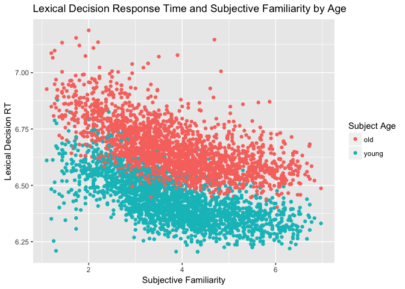
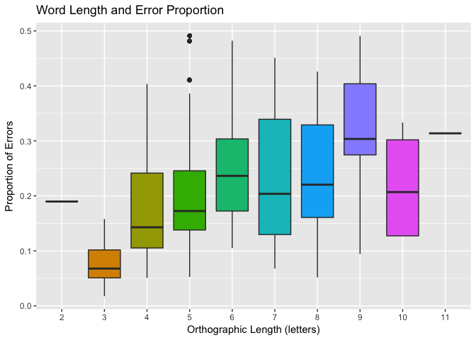
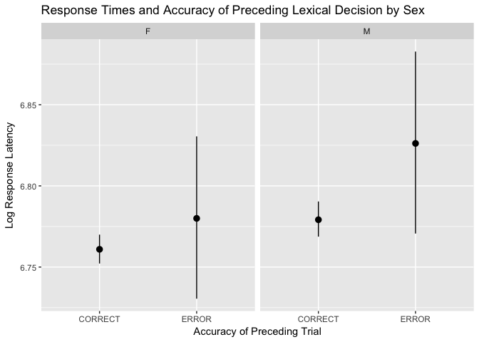

## Plot 1

For the first plot, I used the dataset `english` and made a scatterplot examining the relationship between response time in a visual lexical decision task and subjects' subjective judgments about familiarity of monomorphemic words. The plot suggests that subjects respond more quickly to the decision task for words they identify as more familiar to them.


```r
ggplot(english, aes(Familiarity, RTlexdec, color = AgeSubject))+
  geom_point()+
  labs(x = "Subjective Familiarity", y = "Lexical Decision RT", color = "Subject Age",
       title = "Lexical Decision Response Time and Subjective Familiarity by Age")
```

<!-- -->

I made the decision to separate the points by `Subject Age` to improve clarity. This separation also suggests that younger subjects tended to respond to the visual lexical decision task more quickly than older subjects.

## Plot 2

For the boxplot, I used the `beginningReaders` dataset. I was interesed in exploring whether, since the subjects were in early stages of learning to read, word length had an effect on the accuracy of lexical decision task responses. The average proportion of errors appears to increase with the orthographic length of the words (with exception of words with 10 letters).


```r
ggplot(beginningReaders, aes(as.factor(OrthLength), ProportionOfErrors))+
  geom_boxplot(aes(fill = as.factor(OrthLength)), show.legend = FALSE)+
  labs(x = "Orthographic Length (letters)", y = "Proportion of Errors",
       title = "Word Length and Error Proportion")
```

<!-- -->


Initially, I was confused by the results for words of length 2 and 11. I thought that perhaps there were no words of those lengths, so I checked by creating a short summary of the number of target words by number of letters.


```r
beginningReaders %>%
  group_by(., OrthLength) %>%
  summarize(., n())
```

```
## # A tibble: 10 x 2
##    OrthLength `n()`
##         <int> <int>
##  1          2    47
##  2          3   374
##  3          4  1385
##  4          5  1717
##  5          6  2050
##  6          7  1391
##  7          8   540
##  8          9   219
##  9         10   165
## 10         11    35
```

Words of length 2 and 11 were both included in the study, albeit much fewer than words between 3 and 10 letters in length.

## Plot 3

For the last plot, I used the `danish` dataset, which included a lexical decision task using auditory cues. This was the only dataset that included the sex of the participants as a variable. This set also included the accuracy of the previous trial for each trial, so I decided to examine whether this had an effect on reaction time, and whether men and women performed differently in this regard.


```r
ggplot(danish, aes(PrevError, LogRT)) +
  stat_summary(fun.data = mean_cl_boot, geom = "pointrange")+
  facet_grid(.~Sex)+
  labs(x = "Accuracy of Preceding Trial", y = "Log Response Latency",
       title = "Response Times and Accuracy of Preceding Lexical Decision by Sex")
```

<!-- -->

On average, when the previous trial received a correct response, subjects' response times were faster and with less variation. When subjects made an error in the preceding trial, they tended to take longer to respond for the following word, and there was greater variability in the amount of time. This seems to be true for both male (M) and female (F) participants in the study.
